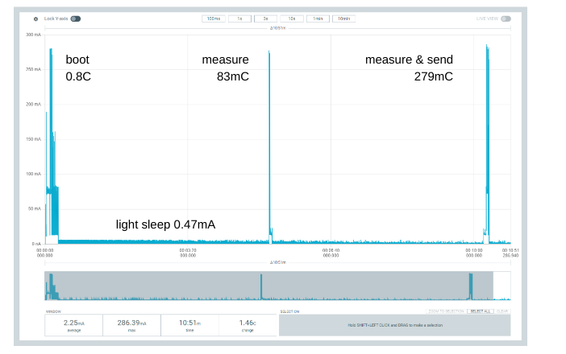

# Smart Meter
Smart Meter is a temperature, humidity, barometric pressure and air quality measurement & logging platform.

## Components
The system has the following components:
* Sensor (WiFi connected device doing the measurements) and Firmware
* Frontend (Website to present the measurements to the user)
* Backend (Database containing the measurements)

## Sensor
The sensor connects via WiFi to the home network and broadcasts its measurements in a 15min interval via UDP broadcasting.
Measurements are taken every 5min by the Bosch BME680.
The ESP32-C3 runs the firmware handling data acquisition and WiFi connectivity.
The device is powered by 4 AA batteries and lasts for about 2.5 months on a single charge.
Each device has a unique ID derived from its MAC address.

The firmware is built on Espressif's [esp-rs](https://github.com/esp-rs).


### Power Profile


|State   |Charge   | Avg. Current |
|--------|---------|--------------|
|Boot           | 800mC | -       |
|Measure        | 83mC  | -       |
|Measure + Send | 279mC | -       |
|Light Sleep    | -     | 0.47mA  |

## Frontend
The frontend is hosted on a local server (e.g., a NAS) running the fontend docker image.
It uses the [yew framework](https://github.com/yewstack/yew) (web app with WebAssembly written in Rust) and communicates with the backend via its REST API.


## Backend
The backend uses [Diesel](https://diesel.rs/) to interface with an SQL database (sqlite) and provides a REST API to clients (the frontend) allowing those to request measurements and manage sensors.
The REST API ([Actix framework](https://actix.rs/)) features the following routes:
* GET ```/api/measurements/by_date```: Returns all measurements of a given device between a start and end data
* GET ```/api/measurements/info```: Return general information about measurements of a given device (e.g., the measurement period)
* GET ```/api/measurements/all```: Returns all measurements of a given device, samples down the measurements not to exceed a certain amount
* GET ```/api/devices```: Returns a list of all measurements
* GET ```/api/device_name```: Returns the name of a device by ID
* POST ```/api/device_name```: Sets the name of a device by ID

The backend also listens to UDP port ```8989``` on the broadcast address ```0.0.0.0``` and picks up new device on their first broadcast.


## Docker
Frontend and backend are bundled into a single docker image, making it very easy to deploy on all systems supporting containers.

## License
Smart Meter is licensed under CC BY-NC 4.0 